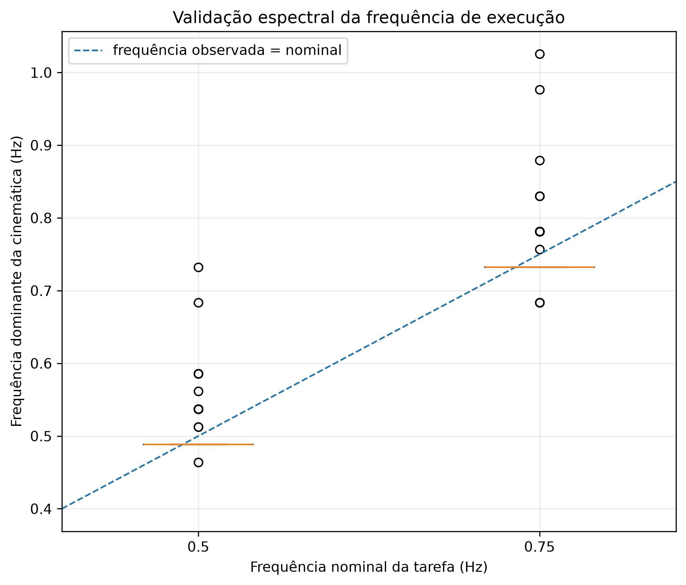
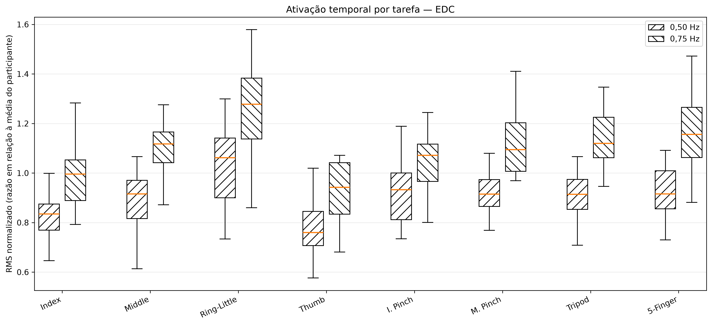
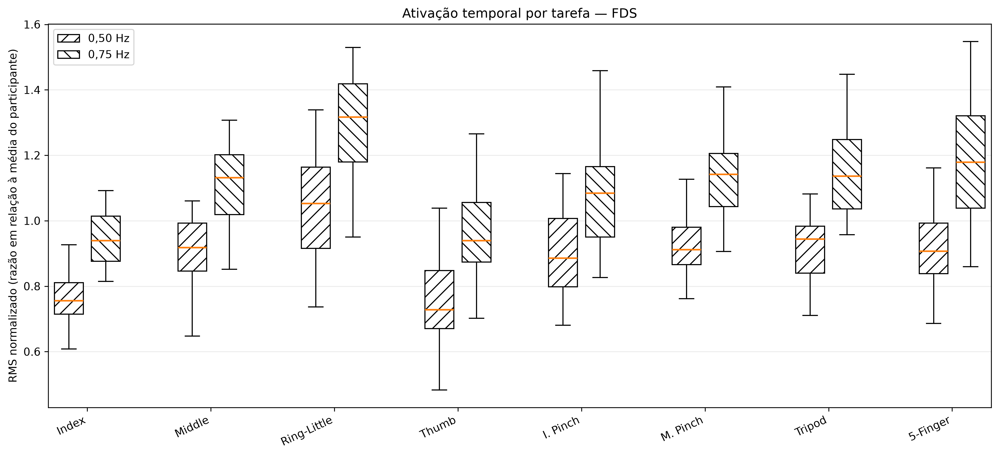
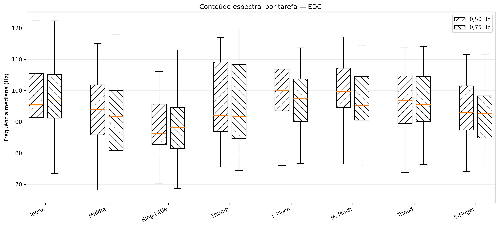
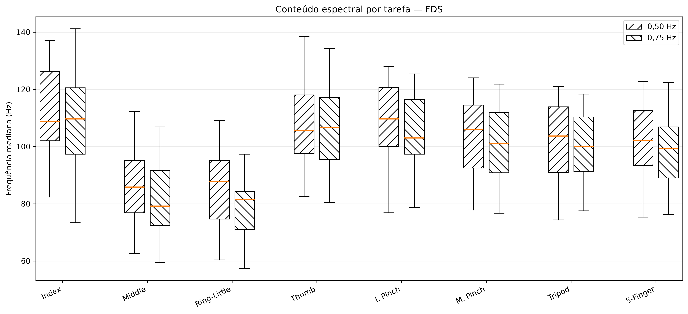

# Análise de Movimentos da Mão com HD-sEMG

Análise temporal, espectral e espacial de sinais de eletromiografia de superfície de alta densidade (HD-sEMG) durante movimentos da mão, com foco em características que possam futuramente contribuir para a estimativa da intenção motora e para o controle de próteses mioelétricas.

## Motivação

Próteses mioelétricas utilizam a atividade muscular residual para inferir a intenção de movimento do usuário. Diferentes movimentos da mão podem produzir padrões de ativação distintos e parcialmente sobrepostos nos músculos do antebraço.

O HD-sEMG permite observar essa atividade em múltiplos canais. Assim, é possível investigar características temporais, espectrais e, futuramente, espaciais que possam ser úteis para estimar o movimento pretendido.

Nesta primeira etapa, ainda não treinamos um estimador de movimento. O objetivo é verificar se as características do HD-sEMG variam de forma sistemática com a tarefa executada e com a velocidade do movimento.

## Pergunta de pesquisa

> Quais características temporais, espectrais e espaciais dos sinais HD-sEMG apresentam maior sensibilidade aos diferentes movimentos da mão, e como esses padrões de ativação se relacionam com a cinemática?

## Hipótese de trabalho

Diferentes movimentos e velocidades de execução produzem padrões distintos de recrutamento dos músculos **Extensor Digitorum Communis (EDC)** e **Flexor Digitorum Superficialis (FDS)**.

Essas diferenças podem ser observadas na amplitude do sinal, no conteúdo espectral e na distribuição da atividade entre os canais de HD-sEMG. Essas características poderão, em uma etapa futura, servir de entrada para modelos de estimativa da intenção motora.

## Base de dados

O projeto utiliza a base pública:

**HD sEMG of Forearm Muscles and 3D Hand Kinematics During Sinusoidally-Modulated Finger Movements and Grasping Tasks**

DOI: `10.6084/m9.figshare.31032934`

Principais características:

- 21 participantes saudáveis;
- 8 tarefas motoras da mão;
- 2 frequências de execução: **0,50 Hz** e **0,75 Hz**;
- 3 repetições por condição;
- 1007 gravações válidas de movimento;
- 128 canais de HD-sEMG:
  - canais 1–64: EDC;
  - canais 65–128: FDS;
- HD-sEMG amostrado a 2052,52 Hz;
- cinemática da mão amostrada a 100 Hz.

As oito tarefas são:

1. flexão-extensão do dedo indicador;
2. flexão-extensão do dedo médio;
3. flexão-extensão acoplada dos dedos anelar e mínimo;
4. oposição-reposição do polegar;
5. pinça indicador-polegar;
6. pinça médio-polegar;
7. pinça trípode;
8. abertura e fechamento dos cinco dedos.

### O que significam 0,50 Hz e 0,75 Hz?

Essas frequências fazem parte do protocolo experimental original do dataset e representam a **velocidade de execução do movimento**, não a frequência do sinal EMG.

Os participantes seguiam uma referência visual sinusoidal:

- **0,50 Hz**: um ciclo completo de movimento a cada 2 s;
- **0,75 Hz**: um ciclo completo de movimento a cada aproximadamente 1,33 s.

Ter o mesmo movimento em duas velocidades permite verificar se uma característica do EMG está associada à tarefa ou se também é influenciada pela velocidade de execução.

Isso é relevante para aplicações em próteses, pois um futuro estimador deve idealmente reconhecer a mesma intenção motora mesmo quando o movimento é executado mais rápido ou mais devagar.

## Etapa 1 — Fluxo de processamento

```text
HD-sEMG bruto + cinemática
            |
            v
      intervalo 5–40 s
            |
            v
filtro passa-altas Butterworth
      fc = 20 Hz, ordem 4
            |
            v
     +------------------+
     |                  |
     v                  v
Análise temporal    Análise espectral
RMS, 100 ms         PSD por Welch
                    frequência mediana
     |                  |
     +--------+---------+
              |
              v
         EDC e FDS
              |
              v
   8 tarefas × 2 velocidades
              |
              v
análise estatística de medidas repetidas
```

## Justificativa das escolhas de processamento

Antes de processar o dataset completo, foram realizadas análises exploratórias para avaliar:

- conteúdo de baixa frequência no HD-sEMG bruto;
- possível interferência estreita em 60 Hz;
- filtros passa-altas com cortes de 5, 10 e 20 Hz;
- janelas RMS de 50, 100, 150 e 200 ms.

Foi adotado um filtro passa-altas Butterworth de quarta ordem com corte em 20 Hz. A escolha foi feita após comparar diferentes cortes e verificar forte redução do conteúdo abaixo de 20 Hz, mantendo praticamente inalterada a potência na faixa de 30–500 Hz.

A janela RMS de 100 ms foi escolhida como compromisso entre suavização e resolução temporal.

Mais detalhes estão em [`docs/analysis_decisions.md`](docs/analysis_decisions.md).

## Técnica principal de análise de sinais — PSD por Welch

A técnica principal do trabalho é a **densidade espectral de potência (PSD)** estimada pelo método de Welch.

O método divide o sinal em segmentos sobrepostos, aplica uma janela a cada segmento, estima seus periodogramas e realiza a média:

\[
\hat{S}_{xx}(f)=\frac{1}{K}\sum_{k=1}^{K}P_k(f)
\]

em que \(P_k(f)\) representa o periodograma do segmento \(k\).

A partir da PSD também é calculada a frequência mediana, definida pela condição:

\[
\int_{f_{\min}}^{f_{\mathrm{med}}}S_{xx}(f)\,df
=
\frac{1}{2}
\int_{f_{\min}}^{f_{\max}}S_{xx}(f)\,df
\]

O RMS é utilizado como uma análise temporal complementar.

## Análise estatística

A unidade experimental adotada é o **participante**, e não cada gravação individual.

As três repetições são primeiro agregadas dentro de cada combinação participante × tarefa × frequência. Em seguida são utilizados:

- teste de Friedman para comparar as oito tarefas;
- **W de Kendall** como tamanho de efeito;
- teste pareado de Wilcoxon para comparar 0,50 Hz e 0,75 Hz;
- correção de Holm para múltiplas comparações.

# Primeiro avanço do projeto

## 1. Validação da frequência do movimento pela cinemática

Nesta etapa, os ângulos da mão ainda não estão sendo utilizados como alvo de regressão. A cinemática é utilizada primeiro para verificar se os movimentos foram realmente executados próximos às frequências definidas no protocolo.

| Frequência nominal | Frequência dominante média observada |
|---:|---:|
| 0,50 Hz | 0,491 Hz |
| 0,75 Hz | 0,736 Hz |

Apenas 5 das 1007 gravações apresentaram desvio absoluto superior a 0,10 Hz em relação à frequência nominal.



Isso indica que, de forma geral, os participantes seguiram adequadamente o ritmo experimental.

## 2. Resultados temporais — RMS

O RMS apresentou diferenças significativas entre as oito tarefas, tanto para EDC quanto para FDS.





| Sinal | Velocidade | W de Kendall |
|---|---:|---:|
| RMS EDC | 0,50 Hz | 0,271 |
| RMS EDC | 0,75 Hz | 0,268 |
| RMS FDS | 0,50 Hz | 0,262 |
| RMS FDS | 0,75 Hz | 0,277 |

As comparações pareadas também mostraram aumento significativo do RMS em 0,75 Hz em relação a 0,50 Hz nas oito tarefas, para EDC e FDS.

### Interpretação

O RMS contém informação relacionada à tarefa, mas também é sensível à velocidade de execução.

Isso é importante para uma futura aplicação em próteses: um sistema baseado somente na amplitude do sinal poderia confundir mudanças de velocidade com mudanças de intenção motora.

## 3. Resultados espectrais — frequência mediana

A PSD foi estimada pelo método de Welch e a frequência mediana foi extraída do espectro.





| Sinal | Velocidade | W de Kendall |
|---|---:|---:|
| Frequência mediana EDC | 0,50 Hz | 0,283 |
| Frequência mediana EDC | 0,75 Hz | 0,330 |
| Frequência mediana FDS | 0,50 Hz | 0,590 |
| Frequência mediana FDS | 0,75 Hz | 0,661 |

O maior efeito relacionado à tarefa foi observado na frequência mediana do FDS.

### Interpretação

A distribuição espectral do FDS mostrou forte sensibilidade ao tipo de tarefa executada.

Neste momento, isso deve ser interpretado como **sensibilidade às diferenças entre tarefas**, e não como desempenho comprovado de classificação. Ainda não foi treinado um classificador nesta etapa.

## Relação com o objetivo de estimar movimento

O primeiro avanço mostra que diferentes movimentos da mão produzem diferenças mensuráveis nas características temporais e espectrais do HD-sEMG.

A direção futura do projeto é:

```text
Intenção motora
      |
      v
Ativação muscular do antebraço
      |
      v
HD-sEMG
      |
      v
Características temporais + espectrais + espaciais
      |
      v
Estimador de movimento
      |
      v
Movimento estimado / comando para prótese
```

O projeto ainda não propõe um controlador completo de prótese. A etapa atual busca identificar e compreender quais características do sinal têm maior potencial para representar a intenção motora.

## Estado atual

### Concluído

- processamento das 1007 gravações válidas;
- análise temporal por RMS;
- PSD pelo método de Welch;
- cálculo da frequência mediana;
- validação da frequência de movimento com a cinemática;
- análise estatística em nível de participante;
- comparação entre tarefas com Friedman e W de Kendall;
- comparação entre 0,50 Hz e 0,75 Hz com Wilcoxon pareado e correção de Holm.

### Em andamento

- análise espacial das matrizes de EDC e FDS;
- análise sistemática da relação entre HD-sEMG e ângulos da mão;
- aprofundamento da interpretação fisiológica com literatura.

### Próximas etapas

- confirmar a organização espacial dos canais das matrizes 8 × 8;
- avaliar características espaciais do HD-sEMG;
- quantificar a relação entre ativação muscular e cinemática;
- avaliar classificação dos oito movimentos;
- investigar estimativa contínua dos ângulos a partir do HD-sEMG;
- analisar robustez à velocidade de execução;
- discutir aplicações futuras em controle de próteses mioelétricas.

## Estrutura do repositório

```text
hdsemg-hand-movement-analysis/
├── src/
│   ├── 01_preliminary_analysis.py
│   ├── 02_full_dataset_analysis.py
│   └── 03_analyze_results.py
├── docs/
│   ├── methodology.md
│   ├── analysis_decisions.md
│   └── project_progress.md
├── data/
│   └── README.md
├── results/
│   ├── figures/
│   └── tables/
├── README.md
├── requirements.txt
└── .gitignore
```

## Scripts principais

### `01_preliminary_analysis.py`

Análise exploratória de uma gravação, utilizada para inspecionar o HD-sEMG bruto, PSD, filtragem, RMS e relações preliminares entre EMG e cinemática.

### `02_full_dataset_analysis.py`

Processa as gravações válidas e extrai métricas temporais, espectrais e cinemáticas.

### `03_analyze_results.py`

Agrupa as repetições em nível de participante, executa as análises estatísticas e gera as principais figuras.

## Reprodutibilidade

Instale as dependências com:

```bash
pip install -r requirements.txt
```

A base de dados bruta não é redistribuída neste repositório devido ao seu tamanho.

## Disciplina

**IA753 — Análise de Sinais Biológicos**  
FEEC — Universidade Estadual de Campinas
